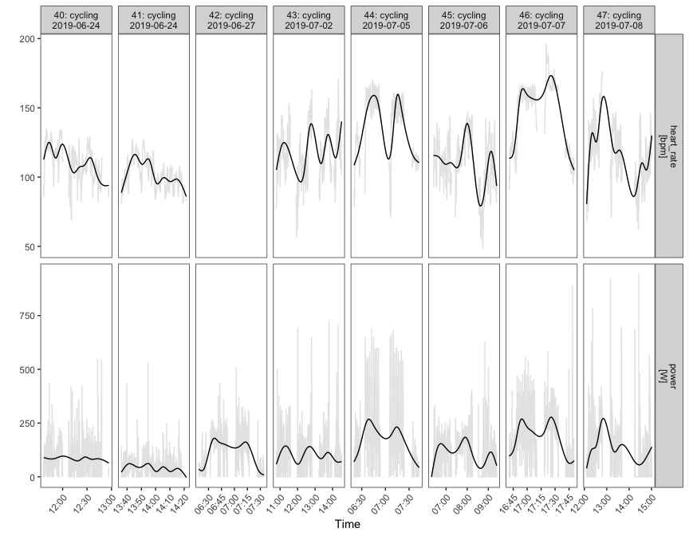
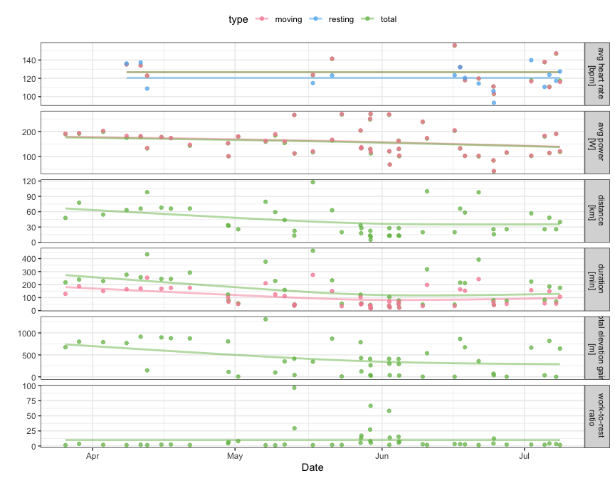
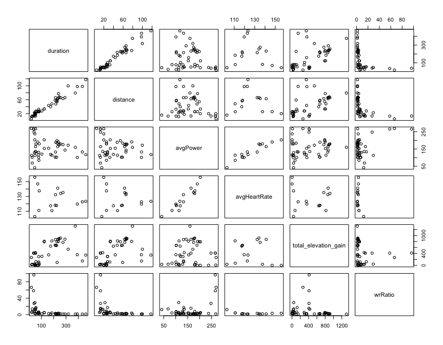
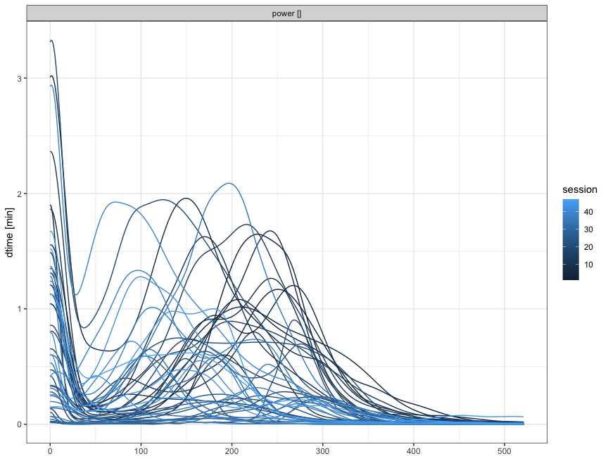

<!-- README.md is generated from README.Rmd. Please edit that file -->

GoldenCheetahOpenData
=====================

<!-- badges: start -->

<!-- badges: end -->

Introduction
------------

The **GoldeCheetahOpenData** R package provides methods for querying the
GoldenCheetah OpenData Project database &lt;doi:
10.17605/OSF.IO/6HFPZ&gt;, downloading workout data from it and managing
local workout databases. Methods are also provided for the organization
of the workout data into ‘trackeRdata’ objects for further data analysis
abd modelling in R using the infrastructure provided by the ‘trackeR’ R
package
<a href="https://CRAN.R-project.org/package=trackeR" class="uri">https://CRAN.R-project.org/package=trackeR</a>.

Installation
------------

You can install the released version of GoldenCheetahOpenData from
[CRAN](https://CRAN.R-project.org) with:

    install.packages("GoldenCheetahOpenData")

The development version can be installed directly from
[GitHub](https://github.com/) with:

    # install.packages("devtools")
    devtools::install_github("ikosmidis/GoldenCheetahOpenData")

Workflow
--------

**GoldenCheetahOpenData** implements a simple query-download-read
workflow, that allows users to gradually build a local workout
repository.

### Querying GoldenCheetah OpenData project’s mirrors

The first step in **GoldenCheetahOpenData**’s workflow is to query the
mirrors of the GoldenCheetah OpenData project for the available IDs.
This is done with a call to `get_athelte_ids()`, which will create a
`gcod_db` object.

    library("GoldenCheetahOpenData")
    ids <- get_athlete_ids()
    class(ids)
    #> [1] "gcod_db" "list"

### `gcod_db` objects

`gcod_db` objects have two perspectives: a remote perspective describing
the state of the GoldenCheetah OpenData project’s database, and a local
describing the state of any local database (more on this later).

`gcod_db` objects that are produced by `get_athlete_ids()` have no
records in their local perspective because none have been downloaded.

    print(ids, txtplot = TRUE)
    #> Remote perspective
    #> Mirror: S3 
    #> Number of athlete IDs: 6566 
    #> File sizes: min = 301 bytes | max = 251.8 Mb | total = 107.1 Gb 
    #> Last modified: between 2018-11-17 10:20:38 and 2020-05-26 19:59:07 
    #> Athlete ID records modified per year quarter:
    #>      +--+-----------+----------+----------+----------+----------+----------+---+
    #>      |                                                          =              |
    #>   25 +  =                                                       =              +
    #>      |  =                                                       =              |
    #> A    |  =                                                       =              |
    #> t 20 +  =                                                       =          =   +
    #> h    |  =                                                       =          =   |
    #> l    |  =                                                       =          =   |
    #> e 15 +  =                                                       =          =   +
    #> t    |  =                                                       =          =   |
    #> e 10 +  =           =                                           =          =   +
    #> s    |  =           =                                           =          =   |
    #>      |  =           =          =                                =          =   |
    #> %  5 +  =           =          =          =                     =          =   +
    #>      |  =           =          =          =          =          =          =   |
    #>      |  =           =          =          =          =          =          =   |
    #>    0 +  =           =          =          =          =          =          =   +
    #>      +--+-----------+----------+----------+----------+----------+----------+---+
    #>         1           2          3          4          5          6          7    
    #> Legend: 
    #> 1=2018-10-01, 2=2019-01-01, 3=2019-04-01, 4=2019-07-01, 5=2019-10-01, 6=2020-01-
    #> 01, 7=2020-04-01
    #> 
    #> Local perspective
    #> Number of athlete IDs: 0

The output above also gives us a quick snapshot of GoldenCheetah
OpenData project’s database. It currently has a massive

    format(total_size(ids), unit = "auto")
    #> [1] "107.1 Gb"

worth of *compressed* workouts for

    n_ids(ids, perspective = "remote")
    #> [1] 6566

athletes. And it keeps growing!

### Downloading workouts

`gcod_db` objects can directly be passed into the `download_workouts()`
function for getting the workouts for the athlete IDs in the remote
perspective or at least a few of them. Below we only get the workouts
for those athletes whose IDs contain **b7-9** (as a big fan of the [Star
Trek Voyager series](https://en.wikipedia.org/wiki/Star_Trek:_Voyager),
this choice made sense to me!).

    ids_b79 <- download_workouts(ids,
                                 pattern = "b7-9",
                                 local_dir = "~/Downloads/GCOD-db/",
                                 verbose = TRUE)
    #> 6f0380b7-92d0-4c19-a56d-85ac3bf472a6.zip exists and `overwrite = FALSE`. Skipping.
    #> a3ccd92b-87f0-422d-adb7-91ab3e6021aa.zip exists and `overwrite = FALSE`. Skipping.
    #> af3ab0e9-fc82-43b7-9d5b-60d496b77d70.zip exists and `overwrite = FALSE`. Skipping.
    #> e104e895-9ecc-40b7-9e62-c1c8823ae0d8.zip exists and `overwrite = FALSE`. Skipping.

`download_workouts()` downloaded the requested workout data on my disk
and placed them in the directory “~/Downloads/GCOD-db/”

    dir("~/Downloads/GCOD-db")
    #> [1] "6f0380b7-92d0-4c19-a56d-85ac3bf472a6.rds"
    #> [2] "6f0380b7-92d0-4c19-a56d-85ac3bf472a6.zip"
    #> [3] "a3ccd92b-87f0-422d-adb7-91ab3e6021aa.rds"
    #> [4] "a3ccd92b-87f0-422d-adb7-91ab3e6021aa.zip"
    #> [5] "af3ab0e9-fc82-43b7-9d5b-60d496b77d70.rds"
    #> [6] "af3ab0e9-fc82-43b7-9d5b-60d496b77d70.zip"
    #> [7] "e104e895-9ecc-40b7-9e62-c1c8823ae0d8.rds"
    #> [8] "e104e895-9ecc-40b7-9e62-c1c8823ae0d8.zip"

`download_workouts()` returns a new `gcod_db` object, updating the local
and remote perspectives of the original `gcod_db` object

    ids_b79
    #> Remote perspective
    #> Mirror: S3 
    #> Number of athlete IDs: 4 
    #> File sizes: min = 2.7 Mb | max = 21.7 Mb | total = 39.9 Mb 
    #> Last modified: between 2019-08-05 07:33:44 and 2020-05-08 20:10:44 
    #> 
    #> Local perspective
    #> Number of athlete IDs: 4 
    #> File sizes: min = 2.7 Mb | max = 21.7 Mb | total = 39.9 Mb 
    #> Last modified: between 2020-05-26 23:50:57 and 2020-05-26 23:51:06

You may save your `gcod_db` files, but this is not really necessary.
They can be reconstructed using the `rebuild_bd()` method, which reads
the local workout database and makes appropriate queries to the
GoldenCheetah OpenData project’s mirrors:

    ids_dir <- rebuild_db("~/Downloads/GCOD-db")
    ids_dir
    #> Remote perspective
    #> Mirror: S3 
    #> Number of athlete IDs: 4 
    #> File sizes: min = 2.7 Mb | max = 21.7 Mb | total = 39.9 Mb 
    #> Last modified: between 2019-08-05 07:33:44 and 2020-05-08 20:10:44 
    #> 
    #> Local perspective
    #> Number of athlete IDs: 4 
    #> File sizes: min = 2.7 Mb | max = 21.7 Mb | total = 39.9 Mb 
    #> Last modified: between 2020-05-26 23:50:57 and 2020-05-26 23:51:06
    ids_b79
    #> Remote perspective
    #> Mirror: S3 
    #> Number of athlete IDs: 4 
    #> File sizes: min = 2.7 Mb | max = 21.7 Mb | total = 39.9 Mb 
    #> Last modified: between 2019-08-05 07:33:44 and 2020-05-08 20:10:44 
    #> 
    #> Local perspective
    #> Number of athlete IDs: 4 
    #> File sizes: min = 2.7 Mb | max = 21.7 Mb | total = 39.9 Mb 
    #> Last modified: between 2020-05-26 23:50:57 and 2020-05-26 23:51:06
    athlete_id(ids_dir, perspective = "local")
    #> [1] "6f0380b7-92d0-4c19-a56d-85ac3bf472a6"
    #> [2] "a3ccd92b-87f0-422d-adb7-91ab3e6021aa"
    #> [3] "af3ab0e9-fc82-43b7-9d5b-60d496b77d70"
    #> [4] "e104e895-9ecc-40b7-9e62-c1c8823ae0d8"
    athlete_id(ids_b79, perspective = "local")
    #> [1] "6f0380b7-92d0-4c19-a56d-85ac3bf472a6"
    #> [2] "a3ccd92b-87f0-422d-adb7-91ab3e6021aa"
    #> [3] "af3ab0e9-fc82-43b7-9d5b-60d496b77d70"
    #> [4] "e104e895-9ecc-40b7-9e62-c1c8823ae0d8"
    athlete_id(ids_dir, perspective = "remote")
    #> [1] "e104e895-9ecc-40b7-9e62-c1c8823ae0d8"
    #> [2] "a3ccd92b-87f0-422d-adb7-91ab3e6021aa"
    #> [3] "6f0380b7-92d0-4c19-a56d-85ac3bf472a6"
    #> [4] "af3ab0e9-fc82-43b7-9d5b-60d496b77d70"
    athlete_id(ids_b79, perspective = "remote")
    #> [1] "6f0380b7-92d0-4c19-a56d-85ac3bf472a6"
    #> [2] "a3ccd92b-87f0-422d-adb7-91ab3e6021aa"
    #> [3] "af3ab0e9-fc82-43b7-9d5b-60d496b77d70"
    #> [4] "e104e895-9ecc-40b7-9e62-c1c8823ae0d8"

A carelless call to `download_workouts()` can easily instruct R to start
downloading all workouts from the **GoldenCheetah OpenData** project,
which is rarely what you want. Instead, I recommend downloading only a
few at a time. This can be done in various ways, including using the
`prefix` argument of `get_athlete_ids()`, the `pattern` argument of
`download_workouts()` (as above) or — a bit more advanced — by directly
subsetting the `gcod_db` object

    ids_sub <- subset(ids, subset = grepl("b7-9", athlete_id(ids)), perspective = "remote")
    athlete_id(ids_sub)
    #> [1] "6f0380b7-92d0-4c19-a56d-85ac3bf472a6"
    #> [2] "a3ccd92b-87f0-422d-adb7-91ab3e6021aa"
    #> [3] "af3ab0e9-fc82-43b7-9d5b-60d496b77d70"
    #> [4] "e104e895-9ecc-40b7-9e62-c1c8823ae0d8"

In this way, whenever you rebuild the `gcod_db` object form the local
database you are getting access to all the workout files you have ever
downloaded.

### Reading workouts

Reading workouts involves: extracting the workout archives for each
athlete ID, reading all the csv files in the extracted directories,
wrangling the information in them (e.g. inferring the workout
timestamps, carrying out data quality checks, imputation, etc), and
organizing the resulting data into objects that can be used for further
analyses. The `read_workouts()` method can do all the above from a
unified interface. For example (and this takes a while):

    b79 <- read_workouts(ids_b79)

By default, `read_workouts()`: - does not overwrite existing directories
with extracted workouts (which can be bypassed by setting
`overwrite = TRUE`) - deletes the extracted directories after everything
has been read (which can be bypassed by setting `clean_db = FALSE`) -
writes the processed `trackeRdata` objects (see `?saveRDS`) in the same
directory as the workout archives, using the convention
`<athlete_id>.rds`.

Analyses of workout data using `trackeR`
----------------------------------------

`b79` is now a list of `trackeRdata` objects, and `trackeR` can be used
for exploration.

    library("trackeR")
    ## Reading was not possible for athlete ID (see `warnings`)
    which(is.na(b79))
    #> a3ccd92b-87f0-422d-adb7-91ab3e6021aa 
    #>                                    2
    ## so we remove them 
    b79 <- b79[!is.na(b79)]
    ## number of workout sessions per athlete ID
    sapply(b79, nsessions)
    #> 6f0380b7-92d0-4c19-a56d-85ac3bf472a6 af3ab0e9-fc82-43b7-9d5b-60d496b77d70 
    #>                                   84                                   47 
    #> e104e895-9ecc-40b7-9e62-c1c8823ae0d8 
    #>                                  274
    ## total duration per athlete ID in hours
    sapply(b79, function(x) sum(session_duration(x, duration_unit = "h")))
    #> 6f0380b7-92d0-4c19-a56d-85ac3bf472a6 af3ab0e9-fc82-43b7-9d5b-60d496b77d70 
    #>                             190.7700                             118.8053 
    #> e104e895-9ecc-40b7-9e62-c1c8823ae0d8 
    #>                             312.0400

Let’s explore further some sessions for athlete ID
`af3ab0e9-fc82-43b7-9d5b-60d496b77d70`

    athlete1 <- b79[["af3ab0e9-fc82-43b7-9d5b-60d496b77d70"]]
    ## Number of sessions
    nsessions(athlete1)
    #> [1] 47
    ## Total workout duration
    athlete1_duration <- session_duration(athlete1)
    sum(athlete1_duration)
    #> Time difference of 118.8053 hours
    ## Make sure we only keep workout sessions with duration more than 10 min
    athlete1 <- athlete1[athlete1_duration > 10/60]
    ## Training times
    timeline(athlete1)

    ## Power and heart_rate for the 80th to 84th workout
    plot(athlete1, session = 40:47, what = c("power", "heart_rate"))

Session summaries can also easily be extracted

    athlete1_summaries <- summary(athlete1)
    ## Let's choose some features (see `?trackeR::plot.trackeRdataSummary`
    ##  for the names of the available summaries, or
    ##  names(data.frame(athlete1_summaries)))
    features <- c("duration", "distance", "avgPower", "avgHeartRate", "total_elevation_gain", "wrRatio")
    ## Plot each feature longitudinally
    plot(athlete1_summaries, what = features)

    ## Plot all pairs of features
    plot(data.frame(athlete1_summaries)[features])

A bit more advanced analytics: The power concentration profiles for the
this athlete ID are

    athlete1_cp <- concentration_profile(athlete1, what = c("power"))
    plot(athlete1_cp, multiple = TRUE)

 and a
functional PCA on them gives that the first 4 components explain about
95% of the variability in the concentration profiles

    athlete1_fpca <- funPCA(athlete1_cp, what = "power", nharm = 5)
    round(athlete1_fpca$varprop[1:5] * 100, 2)
    #> [1] 63.94 24.89  5.24  2.56  1.41
    ## Check which sessions have power datax
    has_power <- !is.na(athlete1_summaries$avgPower)
    ## Scatterplots of the first harmonic against session summaries (high correlation with distance and duration)
    plot(cbind(data.frame(athlete1_summaries)[has_power, features], PC1 = athlete1_fpca$scores[, 1]))

    ## Scatterplots of the second harmonic against session summaries
    plot(cbind(data.frame(athlete1_summaries)[has_power, features], PC2 = athlete1_fpca$scores[, 2]))

    ## etc

Issues
------

Please use **GoldenCheetahOpenData**’s [GitHib issue
page](https://github.com/ikosmidis/GoldenCheetahOpenData/issues) to
report any issues or suggest furth enhancements or improvements.

References and resources
------------------------

See the [trackeR R package CRAN
page](https://cran.r-project.org/package=trackeR) for vignettes on the
use of trackeR.

Frick, H., Kosmidis, I. (2017). trackeR: Infrastructure for Running and
Cycling Data from GPS-Enabled Tracking Devices in R. *Journal of
Statistical Software*, **82**(7), 1–29.
[doi:10.18637/jss.v082.i07](https://doi.org/10.18637/jss.v082.i07)

Liversedge, M. (2020). GoldenCheetah OpenData Project. OSF.
